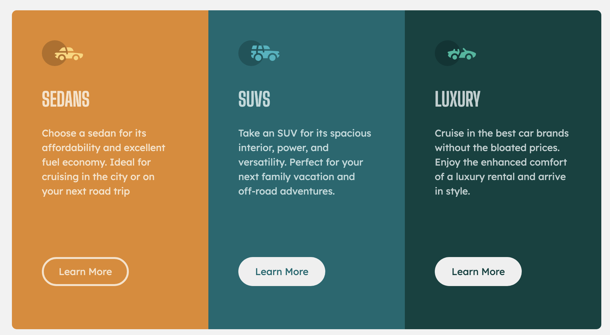
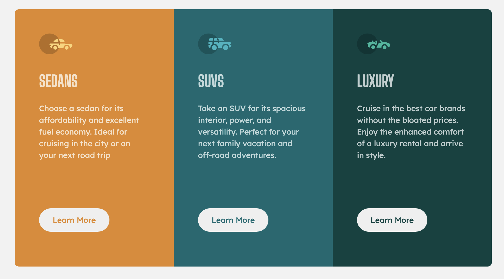
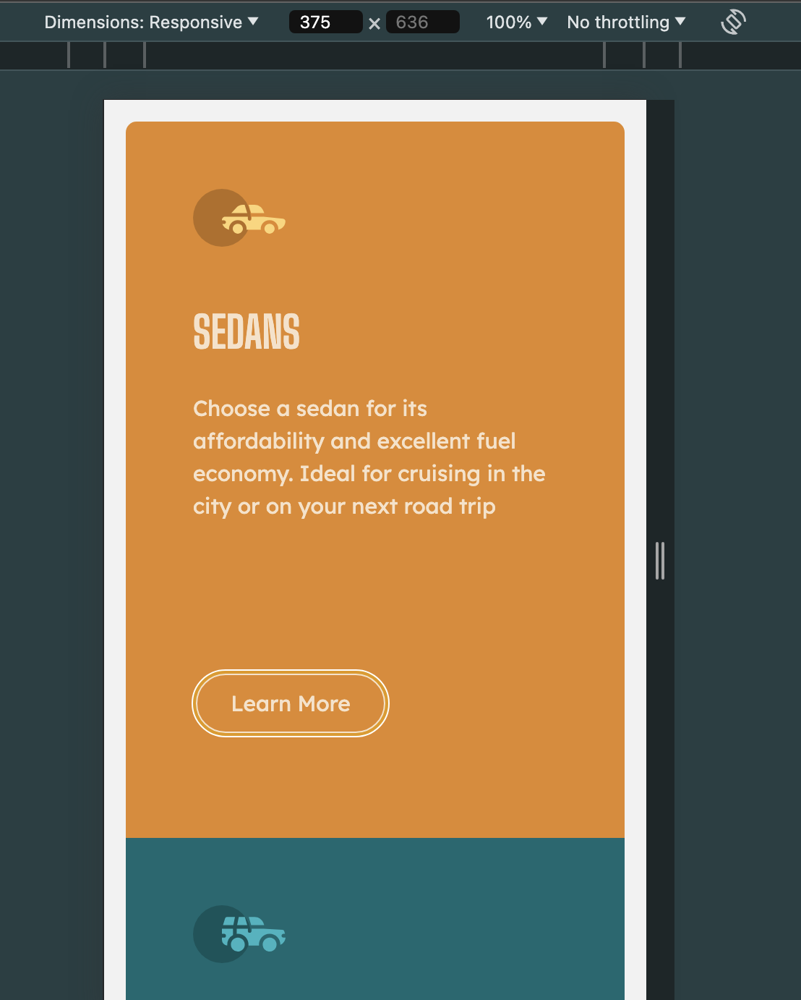

# Frontend Mentor - 3-column preview card component solution

This is a solution to the [3-column preview card component challenge on Frontend Mentor](https://www.frontendmentor.io/challenges/3column-preview-card-component-pH92eAR2-).

## Overview

### The challenge

Users should be able to:

- View the optimal layout depending on their device's screen size
- See hover states for interactive elements

### Screenshot





### Links

- Solution URL: [Add solution URL here](https://your-solution-url.com)
- Live Site URL: [Add live site URL here](https://your-live-site-url.com)

### Built with

- Semantic HTML5 markup
- CSS custom properties
- Flexbox
- CSS Grid

### What I learned

```css
/* 4 */
.main-container {
  display: grid;

  max-width: 61rem;
  /* when the window shrunk height will limit container then so I have to delete it, so I could  manage it through overflow property*/
  /* height: 32rem; */
  border-radius: 0.5rem;
  margin: 1rem;
  overflow: hidden;
  color: var(--transparent-white);
}

/* 10 */
/* since I created a property of --item-variable for each '.item[data-color=""], everytime I will use the custom property it will automatically have the assigned color in the propery declarartion at step no.7 */
button {
  font-family: var(--font-family-400);
  color: var(--item-color);
  border: 0;
  border-radius: 100vh;

  height: 3rem;
  width: 9rem;

  /* This definitely helps */
  /* since button is part of the grid system, I could manually select button element and use align-self: center to it. */
  align-self: center;
  justify-self: start;
}
```

### Continued development

I might probably use a framework in the future.

### Useful resources

- [From Design to Code // HTML & CSS from scratch // Frontend Mentor](https://youtu.be/KqFAs5d3Yl8?si=AtGxByl1a6agAZuf) - This is not the same Frontend Mentor exercise but I used a little bit of his practice as a reference.

## Author

- Frontend Mentor - [@hollyBelly2021](https://www.frontendmentor.io/profile/hollyBelly2021)
